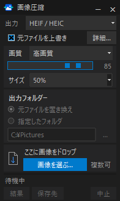

# 画像圧縮ツール（AVIF・HEIF対応）

196 × 328 px のコンパクトなデスクトップGUIです。画像やフォルダーをドロップして、AVIF・HEIF・JPEG・WebP・PNG に変換できます。画像はこの PC 内で処理します。



- AVIF・HEIF を含む形式変換と、元画像に対する割合での縮小
- 画素・透明度・色情報を確認する「完全保持（可逆）」
- 対応する GPU での圧縮と、CPU への自動切り替え
- 撮影情報の保持、元ファイルの上書き、ウィンドウ位置の記憶
- 完了時の通知音、自動終了、常に最前面の切り替え

## Windows で使う

[Releases](https://github.com/Mainlst/compact-avif-heif-compressor/releases/latest) を開き、配布ファイルを選びます。Python のインストールは不要です。

| 配布ファイル | 起動方法 |
| --- | --- |
| **`ImageCompressor.zip`（おすすめ）** | すべて展開し、`ImageCompressor` フォルダー内の `ImageCompressor.exe` を起動します。 |
| `ImageCompressor-color.exe`（単体 EXE） | ファイルをダブルクリックして起動します。 |

ポータブル版は起動時の展開を省けます。`_internal` も必要なので、移動するときは `ImageCompressor` フォルダー全体を移動してください。単体 EXE 版も機能は同じですが、起動ごとにライブラリーを一時フォルダーへ展開します。

起動時は画面の内容・大きさ・保存位置の準備が終わるまで非表示にし、完成した画面だけを表示します。

## 使い方

1. 出力形式、画質、サイズ、保存先を選びます。初期設定は「完全保持（可逆）」です。容量を減らしたい場合は「高画質」などを選び、必要に応じてサイズを `50%` などへ変更します。
2. 画像やフォルダーをドロップするか、ファイル選択ボタンで画像を選びます。選択後に処理を開始します。
3. 「結果」から出力先を確認します。結果のファイルをダブルクリックすると、実際に使った GPU または CPU も確認できます。

元ファイルを置き換える場合は、メイン画面の出力形式のすぐ下にある「元ファイルを上書き」にチェックを入れます。「詳細」で圧縮速度、撮影情報（EXIF）の保持、通知音、自動終了、常に最前面を設定できます。詳細設定と結果一覧は別ウィンドウで開き、メイン画面の大きさは変わりません。処理中は中止ボタンで残りの処理を停止できます。

サイズは縦横を同じ割合で縮小します。`100%` は元のサイズです。「完全保持（可逆）」では品質とサイズの変更は無効になり、出力が元画像より大きくなる場合があります。

保存名は元の名前と出力形式の拡張子だけです。例えば `写真.jpg` を AVIF に変換すると `写真.avif` になります。同名の既存出力は上書きします。初期状態では元ファイルを上書きしません。入力と保存先が同じパスになる場合は、別の保存先を選ぶか、メイン画面の「元ファイルを上書き」を有効にしてください。

**「元ファイルを上書き」を有効にすると、別形式への変換でも元画像を置き換えます。** 指定した保存先にかかわらず元画像と同じフォルダーへ保存し、拡張子が変わる場合は保存結果の検証後に元画像を削除します。

設定と最後に閉じたウィンドウ位置は次回にも引き継がれます。最小化中に閉じても直前の通常位置を保存し、モニター構成が変わった場合は画面内へ補正します。

「通知音」は一括処理の完了時に1回鳴ります。「圧縮後自動終了」はすべて成功したときだけ終了し、中止やエラーがあれば結果を確認できるよう画面を残します。「常に最前面」はメイン画面・詳細・結果に適用されます。3項目とも初期状態では無効で、設定は次回にも引き継がれます。

入力は JPEG・PNG・WebP・AVIF・HEIF・HEIC・BMP・TIFF・GIF に対応します。アニメーションや複数ページ画像は対象外です。対応する GPU が実際に使用できる場合は自動で使用し、可逆保存や GPU で保持できない画像は CPU で処理します。色の間引き、透明度、撮影情報、保存時の検証については [画像変換の詳細](docs/encoding.md)を参照してください。

## ソースから起動

このリポジトリーには実行に使うソース、画像、同梱ツールを含めています。Python 3.10 以上と Tk が必要です。

Windows では、64 ビットの [Python 3](https://www.python.org/downloads/windows/)（3.11〜3.13 を推奨）をインストールし、`launch.bat` を起動します。インストーラーの「Add Python to PATH」と Tcl/Tk を有効にしてください。初回は `.venv-win` と必要なライブラリーを用意するため、インターネット接続が必要です。

Linux では、このフォルダーで次を実行します。

```bash
python3 -m venv .venv
source .venv/bin/activate
python3 -m pip install -r requirements.txt
python3 app.py
```

Tk が見つからない場合は OS のパッケージ管理ツールで `python3-tk` をインストールしてください。ドラッグ＆ドロップは OS と Tk の対応に依存します。

スクリプトは `python3` を使用します。Windows のバッチファイルは `python3` が見つからない場合に `py -3` を使い、作成した仮想環境は Windows の仕様で `python.exe` を実行します。

## Windows の配布物を作成

`vendor` を含めてリポジトリーを取得し、Windows 上で `build.bat` を起動します。必要なビルド依存をインストールし、次の配布物を作成します。

- `dist\ImageCompressor.zip`：すべて展開して使うポータブル版
- `dist\ImageCompressor\ImageCompressor.exe`：ポータブル版の起動ファイル
- `dist\ImageCompressor-color.exe`：単体 EXE 版

同梱ライブラリーとドラッグ＆ドロップ用ファイルを含めるため、完成した配布物は Python をインストールしていない PC でも起動できます。Windows 用 EXE は Windows 上でビルドしてください。同梱ツールのバージョン、チェックサム、ライセンス、再ビルド資料は [依存ライブラリーと同梱資料](docs/encoding.md#依存ライブラリーと同梱資料)にまとめています。

## テスト

```bash
python3 -m unittest discover -s tests -v
```

Linux の画面がない環境では `xvfb-run -a python3 -m unittest discover -s tests -v` を使用できます。画面が利用できない場合、UI のテストはスキップします。
